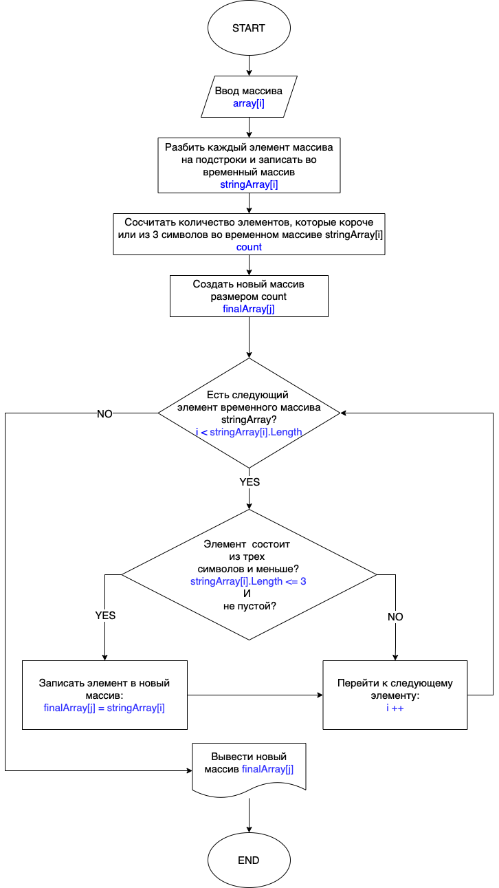

# Итоговая работа

## Условие задачи

Написать программу, которая из имеющегося массива строк формирует массив из строк, длина которых меньше либо равна 3 символа. Первоначальный массив можо ввести с клавиатуры, либо задать на старте выполнения алгоритма. При решении не рекомендуется пользоваться коллекциями, лучше обойтись исключительно массивами.

### _*Пример ввода и результата:*_

["hello", "2", "work", ":-)"] -> ["2", ":-)"]

["1234", "1567", "-2", "computer science"] -> ["-2"]

["Russia", "Denmark", "Kazan"] -> []

## Блок-схема алгаритма решения задачи

## Алгоритм решения задачи

1. Попросить пользователя ввести данные через пробел в консоли.
2. Сформировать из полученных данных строковый массив _**array**_.
3. Создать новый временный строковый массив _**stringArray**_ и заполнить его следующим образом: в первый элемент (i = 0) записать все символы, которые ввел пользователь до первого пробела (или до конца введенной строки, если пользователь использовал любые символы, исключая пробел - в этом случае будет считаться, что введен только один элемент); затем, во второй элемент массива записать все символы после первого пробела и до второго пробела (или до конца введеной строки, если пользователь не использовал второго пробела); в третий - все символы от второго пробела до третьего (или до конца введеной строки, если пользователь не использовал третьего пробела) и т.д. до конца введеной строки.
4. Сосчитать количество не пустых элементов, длина которых равна 3 и меньше _**count**_.
5. Создать массив _**finalArray**_, определенной в пункте 4 размерностью.
6. Взять каждый элемент временного массива _**stringArray**_, начиная с первого (i = 0), и, если его длинна будет меньше или равна 3, то записать его в j-тый элемент массива _**finalArray**_ (начиная с j = 0) и перейти к следующему элементу. Если элемент длиннее 3 символов, то сразу перейти к следующему (i++). Если элементы закончились, то завершить определение длины элементов.
7. Вывести полученный массив _**finalArray**_ на печать в консоль.

